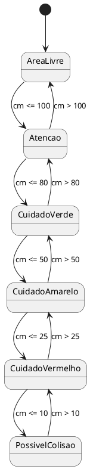

# ARQUITETURA MODULAR - sistema de atracação e auxilio a epilhadeiras evitando colisões

Sistema embarcado baseado em Arduino que auxilia a atracação de embarcações de médio porte e evita acidentes com empilhadeiras, medindo a distância até o cais e emitindo alertas progressivos: **LED, LCD, vibração e som**.

Desenvolvido como projeto da disciplina de IoT — **SENAI Joinville, Análise e Desenvolvimento de Sistemas**.

> Projeto desenvolvido por **Nycolas Gabriel Leodoro**  

---

##  O problema

Embarcações e empilhadeiras de médio porte (pesca e lazer) raramente possuem sensores de proximidade de fábrica na frente. A proa elevada ou as cargas da impilhadeira cria um ponto cego, e vento/correnteza somam inércia à manobra — pequenos descuidos geram colisões contra o cais, com reparos de casco custando de **R$ 2.000 a R$ 5.000+** e dias de embarcação ou manutenção parada.

##  A solução

Dispositivo de baixo custo (**R$ 150–250** estimado), plug & play, com **4 camadas de alerta simultâneas**:

| Camada | Como funciona |
|---|---|
| 🟢🟡🔴 LED | 3 níveis de proximidade (verde → amarelo → vermelho) |
| 📟 LCD 16x2 I2C | Distância exata em cm + mensagens de status |
| 📳 Motor de vibração | Feedback tátil (útil sob sol forte) |
| 🔊 Buzzer piezo | Tom sonoro que fica mais agudo conforme a aproximação |

## 🔧 Hardware

| Componente | Pino Arduino |
|---|---|
| Sensor Ultrassônico PING)))/HC-SR04 (SIG) | D7 |
| LED Vermelho | D11 |
| LED Amarelo | D12 |
| LED Verde | D13 |
| Motor de vibração (via transistor NPN) | D9 (base) |
| Buzzer piezo passivo | D8 |
| Display LCD 16x2 I2C (MCP23008) | SDA / SCL dedicados |

## 📚 Bibliotecas

```cpp
#include <Wire.h>
#include <Adafruit_LiquidCrystal.h>
```

> ⚠️ **Atenção:** o display I2C simulado no Tinkercad usa o chip **MCP23008** (padrão Adafruit), não o **PCF8574** mais comum em módulos reais. Por isso a biblioteca correta é `Adafruit_LiquidCrystal`, e não a mais popular `LiquidCrystal_I2C` — que simplesmente não conversa com esse chip, mesmo com o endereço certo.

## 🧠 Lógica (zonas de alerta)

```
> 100 cm   → Área Livre           (tudo desligado)
80–100 cm  → !Atencao!            (motor liga)
50–80 cm   → !Cuidado! (verde)
25–50 cm   → !Cuidado! (amarelo)
10–25 cm   → !!Cuidado!! (vermelho + motor)
≤ 10 cm    → !!Possivel Colisao!! (vermelho + motor + som agudo)
```

O som é gerado com `tone()` + `map()`, variando de **200 Hz** (longe) a **2000 Hz** (muito perto).

### Diagrama de estados



*(cole em [plantuml.com/plantuml](https://www.plantuml.com/plantuml) para renderizar)*

##  Como simular

1. Abra o projeto no [Tinkercad Circuits](https://www.tinkercad.com/)
2. Adicione a biblioteca `Adafruit_LiquidCrystal` no painel de código
3. Cole o `.ino` deste repositório
4. Clique em **Iniciar simulação** e aproxime um objeto do sensor

## 📄 Licença

Projeto acadêmico — livre para estudo e adaptação (open source).
